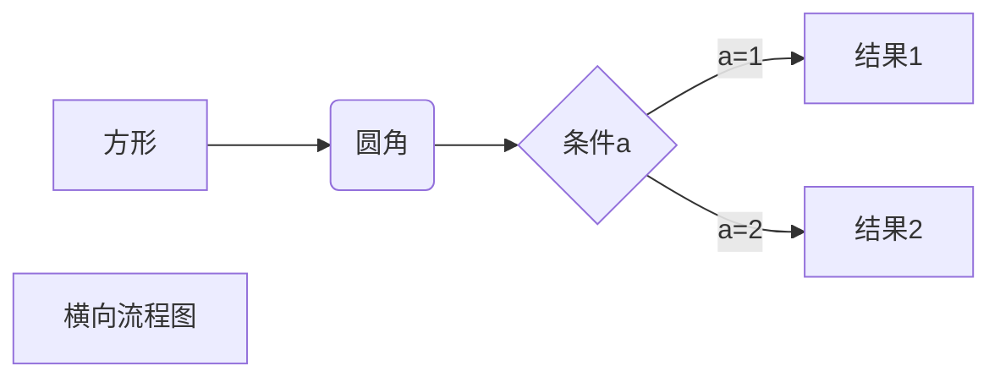
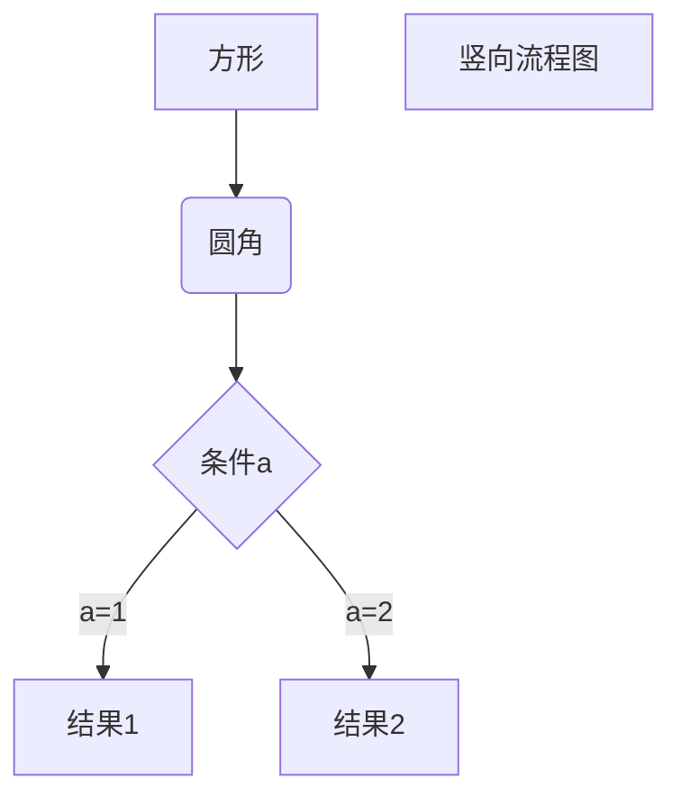
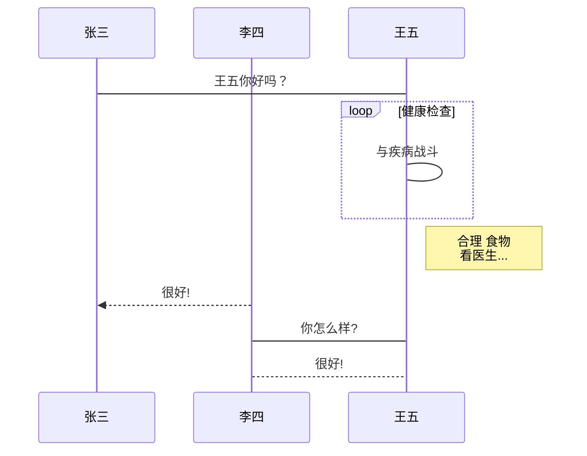
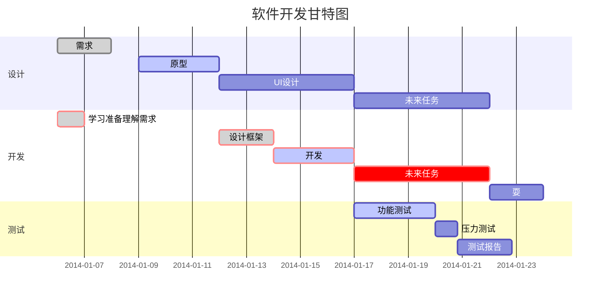

# markdown_learn1
# 2019.11.18
# 使用typora软件可编辑 
# [参考文档-菜鸟教程](https://www.runoob.com/markdown/md-tutorial.html)
# 1.一级标题 =
这是一级标题
=
这是二级标题
-
# 2.使用#可定义1-6级标题,几个#就是几级标题
# 一级标题
## 二级标题
### 三级标题
#### 四级标题
##### 五级标题
###### 六级标题
###### PC端修改测试,然后push


段落测试  
这是第一段  
这是第二段  

这是第三段

# 3.字体设置
*斜体文本*  
_斜体文本_  
**粗体文本**  
__粗体文本__  
***粗斜体文本***  
___粗斜体文本___  

# 4.分割线,一行中使用三个及以上星号 减号 下划线均可创建分割线,行内不能有其他,可有空格
***
* * *
****
----
____

# 5.删除线,文字两端加两个波浪线~~ ~~
~~此行删除~~

# 6.下划线 <u>下划线</u> github貌似不支持

<u>下划线测试</u>  
<u>带下划线文本</u>  

# 7.脚注 github貌似不支持
创建脚注格式[^HackOS]  
[^HackOS]: 赵加海的网名

# 8.无序列表 使用* + 或 - 符号作为列表标记,符号(* + -)与文字之间需要有空格,否则不识别 
* 第一项
* 第二项
* 第三项
+ 第一项
+ 第二项
+ 第三项
- 第一项
- 第二项
- 第三项

# 9.有序列表 使用数字加 . 表示
1. 第一项
2. 第二项
3. 第三项

# 10.列表嵌套 在子列表前插入四个空格
1. 第一项
    - 第一项嵌套的第一个元素
    - 第一项嵌套的第二个元素
2. 第二项
    - 第二项嵌套的第一个元素
    - 第二项嵌套的第二个元素
# 11.区块 > 加 空格
> 区块引用  
> 菜鸟教程  
> 学的不仅是技术更是梦想  
> ## 11.1区块嵌套
> 最外层  
> > 第一层嵌套
> >
> > > 第二层嵌套
> ## 11.2区块中使用列表
> > 区块中使用列表
> > 1. 第一项
> > 2. 第二项
> > + 第一项
> > + 第二项
> > + 第三项
> ## 11.3列表中使用区块
> * 第一项
>    > 菜鸟教程  
>    > 学的不仅是技术更是梦想
> * 第二项

# 12.代码 使用反引号 ` 包起来

`printf()` 函数
> # 12.1代码区块 4个空格或1个TAB制表符
    <?php
    echo 'Hello';
    function test(){
      echo 'test';
    }
> # 12.2使用``` ```报过一段代码,并指明语言,也可以不指定
```javascript
$(document).ready(function () {
    alert('RUNOOB');
});
```

# 13.链接 [链接名称](链接地址)  或者<链接地址>

[我的主页](http://zhaojiahai.top)  
<https://www.baidu.com>
> # 13.1高级链接 使用变量 github貌似不支持
谷歌的网址[Google][google]  
[google]: https://www.google.com

# 14.图片
>   
> ---
> ---
>   
> Markdown没法指定图片宽高,需使用html的标签  
> 

# 15.表格 | 分割单元格 -分割表头和其他行
| 表头 |表头|
|---|---|
|单元格|单元格|
|单元格|单元格|

:|左对齐  
|:右对齐  
:-:居中对齐  


|左对齐|右对齐|居中对齐|
|:----| ----:|:----:|
|单元格|单元格|单元格|
|单元格|单元格|单元格|
|单元格|单元格|单元格|
|单元格|单元格|单元格|

# 16.高级功能

## 16.1 支持HTML元素<kbd> <b> <i> <em> <sup> <sub> <br>

>  使用<kbd>Ctrl</kbd>+<kbd>Alt</kbd>+<kbd>Del</kbd>重启电脑

## 16.2 转义

> **文本加粗**
>
> \*\* 正常显示星号\*\*
>
>  Markdown 支持以下这些符号前面加上反斜杠来帮助插入普通的符号： 
>
> \\   反斜线
> \`   反引号
> \*   星号
> \_   下划线
> \{\}  花括号
> \[\]  方括号
> \(\)  小括号
> \#   井字号
> \+   加号
> \-   减号
> \.   英文句点
> \!   感叹号

## 16.2 公式  使用两个美元符 $$ 包裹 TeX 或 LaTeX 格式的数学公式来实现 

> $$
> \mathbf{V}_1 \times \mathbf{V}_2 =  \begin{vmatrix} 
> \mathbf{i} & \mathbf{j} & \mathbf{k} \\
> \frac{\partial X}{\partial u} &  \frac{\partial Y}{\partial u} & 0 \\
> \frac{\partial X}{\partial v} &  \frac{\partial Y}{\partial v} & 0 \\
> \end{vmatrix}
> $$

## 16.3流程图画法



```flow
st=>start: 开始框
op=>operation: 处理框
cond=>condition: 判断框(是或否?)
sub1=>subroutine: 子流程
io=>inputoutput: 输入输出框
e=>end: 结束框
st->op->cond
cond(yes)->io->e
cond(no)->sub1(right)->op
```

```flow
st=>start: 开始框
op=>operation: 处理框
cond=>condition: 判断框(是或否?)
sub1=>subroutine: 子流程
io=>inputoutput: 输入输出框
e=>end: 结束框
st(right)->op(right)->cond
cond(yes)->io(bottom)->e
cond(no)->sub1(right)->op
```

```sequence
对象A->对象B: 对象B你好吗?（请求）
Note right of 对象B: 对象B的描述
Note left of 对象A: 对象A的描述(提示)
对象B-->对象A: 我很好(响应)
对象A->对象B: 你真的好吗？
```

```sequence
Title: 标题：复杂使用
对象A->对象B: 对象B你好吗?（请求）
Note right of 对象B: 对象B的描述
Note left of 对象A: 对象A的描述(提示)
对象B-->对象A: 我很好(响应)
对象B->小三: 你好吗
小三-->>对象A: 对象B找我了
对象A->对象B: 你真的好吗？
Note over 小三,对象B: 我们是朋友
participant C
Note right of C: 没人陪我玩
```



